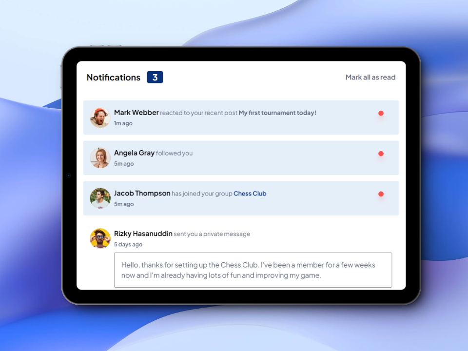
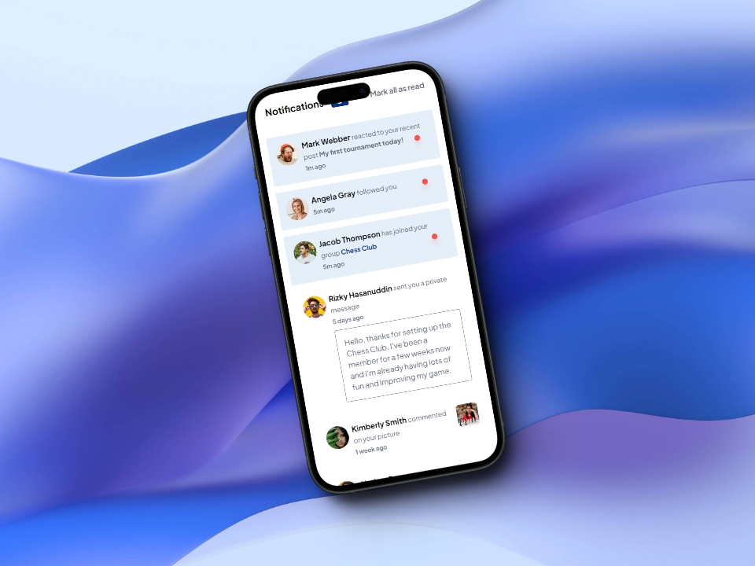

# Frontend Mentor - Notifications page solution

This is a solution to the [Notifications page challenge on Frontend Mentor](https://www.frontendmentor.io/challenges/notifications-page-DqK5QAmKbC). Frontend Mentor challenges help you improve your coding skills by building realistic projects.

## Table of contents

- [Overview](#overview)
  - [The challenge](#the-challenge)
  - [Screenshot](#screenshot)
  - [Links](#links)
- [My process](#my-process)
  - [Built with](#built-with)
- [Author](#author)
- [Acknowledgments](#acknowledgments)

## Overview

### The challenge

Users should be able to:

- Distinguish between "unread" and "read" notifications
- Select "Mark all as read" to toggle the visual state of the unread notifications and set the number of unread messages to zero
- View the optimal layout for the interface depending on their device's screen size
- See hover and focus states for all interactive elements on the page

### Screenshot

### Links

- Live Site URL: [netlify](https://notifications-app-emanuelra94.netlify.app/)

## My process

### Built with 🛠️

- [![Astro][astro-badge]][astro-url] - The web framework for content-driven websites.
- [![Typescript][typescript-badge]][typescript-url] - JavaScript with syntax for types.
- [![Tailwind CSS][tailwind-badge]][tailwind-url] - A utility-first CSS framework for rapidly building custom designs.
- [![React][react-badge]][react-url] - JS library
- Mobile-first workflow
- Semantic HTML5 markup
- CSS custom properties
- Flexbox
- CSS Grid

## Author

- Frontend Mentor - [@emanuel-ra](https://www.frontendmentor.io/profile/emanuel-ra)
- Linkedin - [@emanuelramirezabarca](https://www.linkedin.com/in/emanuelramirezabarca/)

**Note: Delete this note and add/remove/edit lines above based on what links you'd like to share.**

## Acknowledgments

This is where you can give a hat tip to anyone who helped you out on this project. Perhaps you worked in a team or got some inspiration from someone else's solution. This is the perfect place to give them some credit.

**Note: Delete this note and edit this section's content as necessary. If you completed this challenge by yourself, feel free to delete this section entirely.**

[astro-url]: https://astro.build/
[react-url]: https://astro.build/
[typescript-url]: https://www.typescriptlang.org/
[tailwind-url]: https://tailwindcss.com/
[animations-url]: https://tailwindcss-animations.vercel.app/
[astro-badge]: https://img.shields.io/badge/Astro-fff?style=for-the-badge&logo=astro&logoColor=bd303a&color=352563
[react-badge]: https://img.shields.io/badge/React-fff?style=for-the-badge&logo=react&logoColor=#3998B6&color=352563
[typescript-badge]: https://img.shields.io/badge/Typescript-007ACC?style=for-the-badge&logo=typescript&logoColor=white&color=blue
[tailwind-badge]: https://img.shields.io/badge/Tailwind-ffffff?style=for-the-badge&logo=tailwindcss&logoColor=38bdf8
